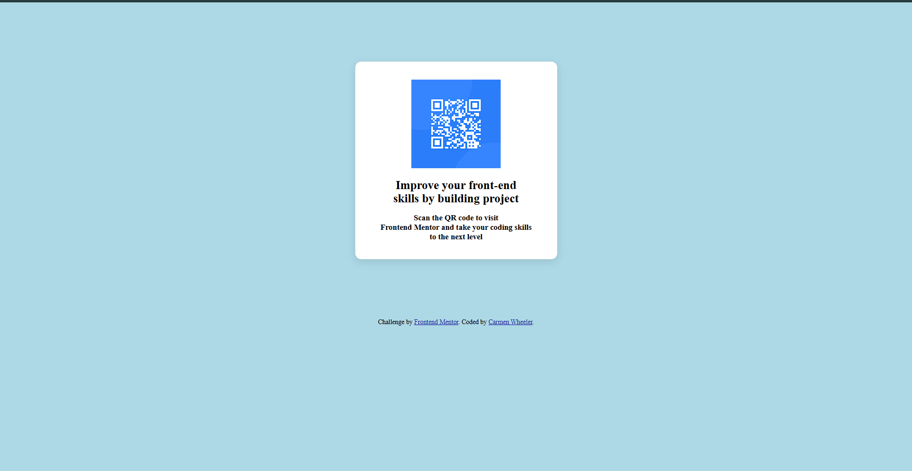

# Frontend Mentor - QR Code Component Solution

This is a solution to the [QR code component challenge on Frontend Mentor](https://www.frontendmentor.io/challenges/qr-code-component-iux_sIO_H). Frontend Mentor challenges help you improve your coding skills by building realistic projects.

---

## 📸 Screenshot

---

## 🔗 Links

- Live Site URL: [Add live site URL here](https://cwqrcode.netlify.app/)
- Solution on Frontend Mentor: [Add solution URL here](https://your-solution-url.com)

---

## 🛠️ My Process

### Built With

- Semantic HTML5
- CSS3 (vanilla)
- Flexbox
- Mobile-first workflow

### What I Learned

As a recent graduate of a full-stack coding bootcamp (May 2025), this was the perfect refresher to reconnect with front-end fundamentals. I focused on:

- Structuring semantic HTML cleanly
- Centering and aligning elements with CSS
- Creating a card-like layout with padding, border-radius, and shadows
- Ensuring layout responsiveness and simplicity

This helped sharpen my eye for layout details and box modeling again — super valuable after more complex project work!

---

## 🚧 Continued Development

I plan to revisit other HTML/CSS challenges to strengthen visual layout speed and accuracy. I'd also like to recreate this component using Tailwind or React in the future.

---

## 📚 Useful Resources

- [CSS Tricks – Centering in CSS](https://css-tricks.com/centering-css-complete-guide/)
- [MDN – HTML `` element](https://developer.mozilla.org/en-US/docs/Web/HTML/Element/img)
- [Frontend Mentor](https://www.frontendmentor.io) – For providing such clean and focused challenges

---

## 👩🏽‍💻 Author

- **Carmen Wheeler**
- [GitHub](https://github.com/OutsideofemiT)
- [Frontend Mentor Profile](https://www.frontendmentor.io/profile/OutsideofemiT)
- Portfolio: [cwport.netlify.app](https://cwport.netlify.app) *(optional placeholder)*

---

## 🙏 Acknowledgments

Thanks to Frontend Mentor for this challenge — it was a great way to re-anchor myself in clean, efficient front-end code after bootcamp!
